<p align="center">
  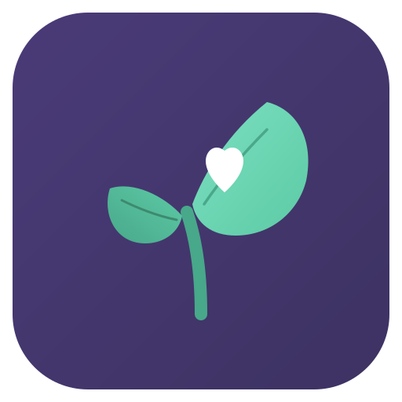
</p>

<h1 align="center">Wellness Companion</h1>

<p align="center">
  <strong>Track your day on your phone. Keep the data on your own devices.</strong>
</p>

<p align="center">
  <a href="https://github.com/Redrum624/wellness-companion/releases"></a>
  <a href="https://github.com/Redrum624/wellness-companion/releases/latest"></a>
</p>

<p align="center">
  <a href="LICENSE"></a>
  
  
</p>

<p align="center">
  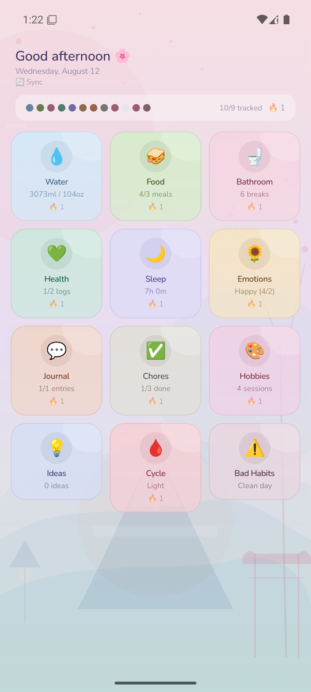
  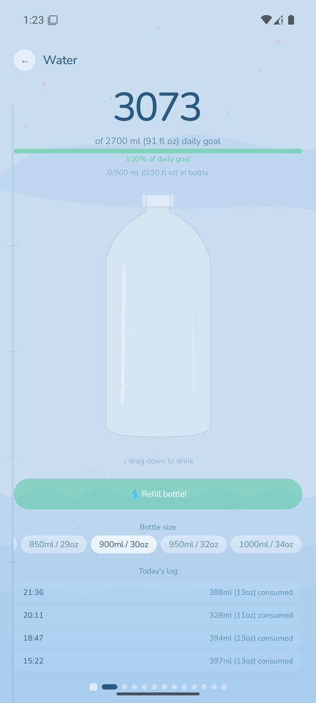
  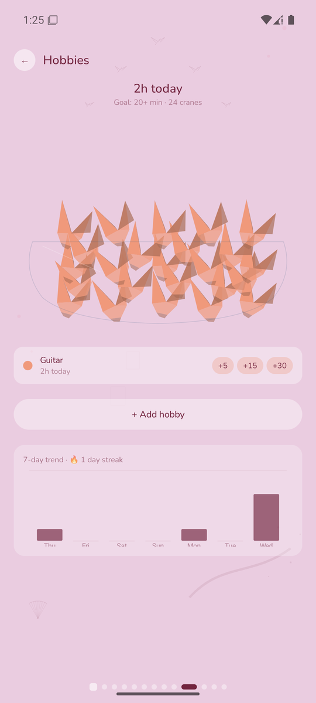
  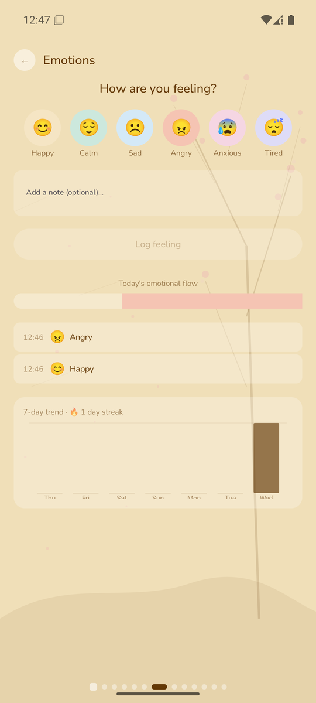
  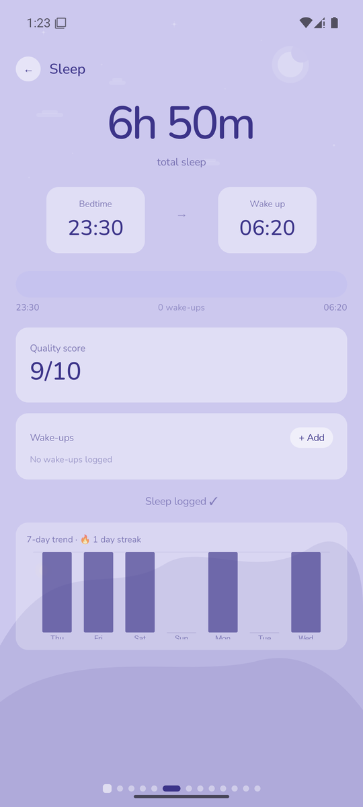
</p>

---

## Why this exists

Your sleep, your mood, your cycle, your symptoms. This is the most personal record you will ever
keep — and here it stays on the devices you already own. Your phone holds it. Your PC holds a copy
if you want a bigger screen. Nothing else holds it at all.

That is possible because there is nothing else: no account to create, no service to sign in to, no
company sitting between you and your own history. The two apps talk straight to each other over
your own Wi-Fi. Even the AI that writes your weekly summary is a 4-billion-parameter model running
on your machine, reading a database on your own disk. Switch the network off and everything still
works exactly the same.

Most trackers ask you to hand this material to a service instead — one whose privacy policy can be
rewritten, whose database can be breached, and whose owners can change their minds about what your
data is for. Wellness Companion can't do any of that to you. Not because it promises not to, but
because it has nowhere to send anything.

The trade is real and worth stating plainly: you give up cloud backup and syncing from anywhere. You
get a health log nobody can read but you.

## What it is

A **phone app** with twelve categories, each its own screen with its own illustrated interaction —
a water bottle you drag to drink from, a bowl that fills with origami cranes as you spend time on a
hobby, an arc that traces your mood from morning to night.

An optional **Windows companion** that stores the full history, draws a year-at-a-glance heatmap,
and writes weekly summaries with a local LLM.

| | Phone (Android) | Desktop (Windows) |
|---|---|---|
| **Role** | Primary — log things as they happen | Optional — analyse, summarise, archive |
| **Stack** | Kotlin · Jetpack Compose · Room | Electron · React · better-sqlite3 |
| **Standalone?** | Yes, fully usable alone | Needs the phone for data |
| **AI** | — | Qwen3-4B, runs locally |

---

## Modules

| | Module | What you log |
|---|---|---|
| 🏠 | **Dashboard** | Today at a glance: progress against each goal, plus streaks |
| 💧 | **Water** | Hydration — drag the bottle to drink; it empties as you go |
| 🥪 | **Food** | Meals and snacks with time, description and rating |
| 🌙 | **Sleep** | Bed/wake times, duration, and a sleep-quality bar |
| 🌻 | **Emotions** | Mood through the day, drawn as an arc from morning to night |
| 💚 | **Health** | Symptoms, medication, weight, general notes |
| 🚽 | **Bathroom** | Bathroom visits — for tracking a gut or urinary condition |
| 🩸 | **Cycle** | Menstrual cycle with phase prediction |
| ✅ | **Chores** | Recurring household tasks from reusable templates |
| 🎨 | **Hobbies** | Time per hobby, shown as a bowl filling with origami cranes |
| 💡 | **Ideas** | Quick capture for thoughts worth keeping |
| 💬 | **Journal** | Free-text diary entries tagged with people you saw |
| ⚠️ | **Bad Habits** | The things you're cutting down on — counted, not judged |
| 🧠 | **Insights** | AI-written weekly summaries · *desktop only* |

## Features

**Sync** — mDNS discovery, end-to-end encrypted over WebSocket on port 9847 (ephemeral ECDH +
AES-256-GCM) · single-code device pairing, no shared password · per-device pairing management —
remove one device without touching the rest · incremental transfers · manual IP fallback when
multicast is blocked.

**On the phone** — hydration, meal, evening check-in and refill reminders · weekly trend charts ·
unit conversion · a small celebration when you hit a goal · earlier ideas grouped by day, not just
today's.

**On the desktop** — offline AI insights via `node-llama-cpp` · a 52-week calendar heatmap · a
chronological timeline of the day across every category · a *manage people* panel that deletes a
person from the journal's suggestion list, and keeps them deleted on every synced device.

**Everywhere** — per-category streaks · daily goals as `X/Y` progress · one-tap quick buttons for
routine amounts · star ratings, sliders and tag input with recall · a consistent pastel colour
system per category · split sleep logging — save a bedtime in the evening, complete the same night
with your wake-up in the morning · entries encrypted at rest on both platforms.

**Installing and updating** — a new Setup installs over the old one and keeps your data; the desktop
app snapshots its database on the first launch after any version change and keeps the last five
snapshots.

---

## The desktop hub

<p align="center">
  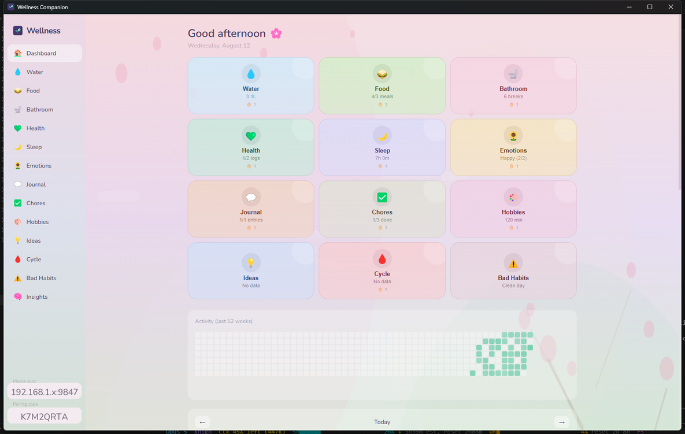
</p>
<p align="center"><sub>Today at a glance, with a year of activity below it. The pairing code lives bottom-left.</sub></p>

### Insights, written locally

Ask a question about your own data, or generate a weekly portrait, a pattern search, or a monthly
deep dive. The model reads your entries from the local database and runs on your GPU — nothing is
uploaded, and the app works exactly the same with the network off.

It is written to be specific rather than reassuring: it cites the actual figures, says plainly when
a day went badly instead of smoothing it over, points out one connection worth your attention, and
ends with a single concrete thing to try.

<p align="center">
  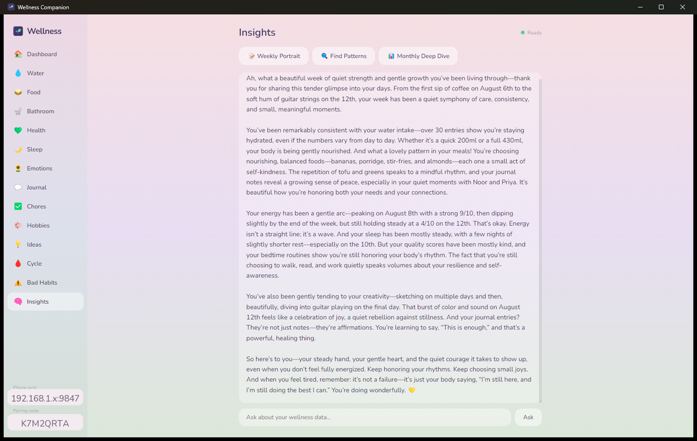
</p>
<p align="center"><sub>A weekly portrait written by Qwen3-4B on-device — here it ties a 180 ml water
day to the tiredness logged that evening, and a drop in energy to a short night's sleep.</sub></p>

---

## Get the apps

**1. Get the phone app.** It isn't on Google Play. Either run the Windows installer, which bundles
the Android package and offers to sideload it over USB, or build it yourself:

```bat
cd android
gradlew.bat assembleDebug
adb install -r app\build\outputs\apk\debug\app-debug.apk
```

> **The released phone build is debug-signed.** It is built with `assembleDebug` and Android's
> universally-known debug key, which means it is marked `debuggable`: anyone with USB access to the
> phone while it is unlocked can read the app's data directory, including your entries. It is fine
> for your own device; treat it as unsuitable for a phone you don't control.
>
> To build a properly signed release instead, create a keystore once and point an untracked
> `android/keystore.properties` at it:
>
> ```bat
> keytool -genkeypair -v -keystore wellness-release.jks -alias wellness ^
>         -keyalg RSA -keysize 4096 -validity 10000
> ```
>
> ```properties
> storeFile=C:/path/to/wellness-release.jks
> storePassword=...
> keyAlias=wellness
> keyPassword=...
> ```
>
> Then `gradlew.bat assembleRelease`. The installer prefers `app-release.apk` when it exists and
> falls back to the debug build with a warning otherwise. `keystore.properties`, `*.jks` and
> `*.keystore` are gitignored — signing material must never be committed.

**2. That's it** — the phone app works on its own. Stop here if you don't want the desktop half.

**3. Optional: add the desktop app.** Download `Wellness Companion Setup <version>.exe` from the
[Releases page](https://github.com/Redrum624/wellness-companion/releases/latest) and run it. One
file contains the app, the Visual C++ runtime, and the Android package.

**4. Pair them.** Open the desktop app and click **Pair a device** in its sidebar for a one-time
code. On the phone, tap **🔄 Sync**, enter the code, tap **Pair**, then **Sync**. Once per device.

### Updating

Run the new `Wellness Companion Setup <version>.exe` over the old install, and install the new APK
over the old app on the phone. **Do not uninstall first** — on Windows and Android alike, installing
over the top keeps your entries; uninstalling the phone app deletes its database with it, so sync to
the desktop before you ever remove it.

The desktop app takes a snapshot of `wellness.db` on the first launch after the version changes and
keeps the last five under `%APPDATA%\wellness-companion\backups\`. Nothing is deleted from your
database by an update — the snapshot is there for the case where something later goes wrong.

---

## Pairing the phone with the PC

Open the desktop app first, then click **Pair a device** in its sidebar for a one-time **pairing
code** — 33 characters, grouped with dashes so it's easy to type. On the phone, tap **🔄 Sync**,
type the code in, tap **Pair**, then **Sync**. You do this once per device; the phone remembers it,
and the desktop sidebar lists every paired device with its own **Remove**, so losing one phone
doesn't mean forgetting the rest.

If mDNS discovery fails — some networks block multicast — type the PC's address in the field below
instead (`192.168.1.42:9847`).

<p align="center">
  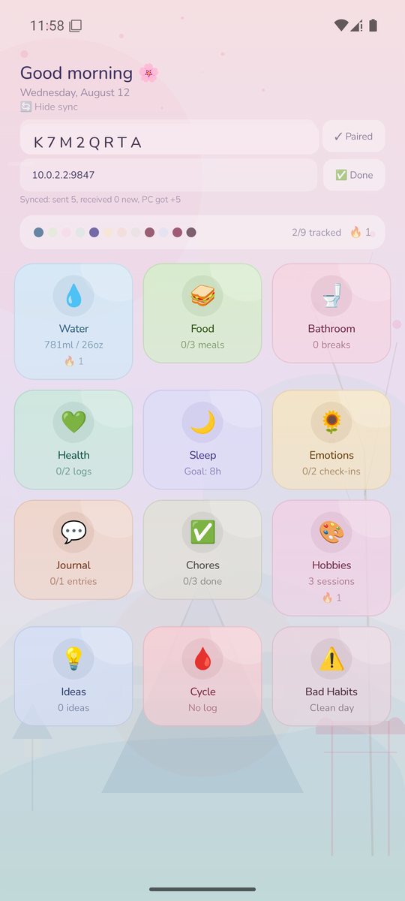
  &nbsp;&nbsp;
  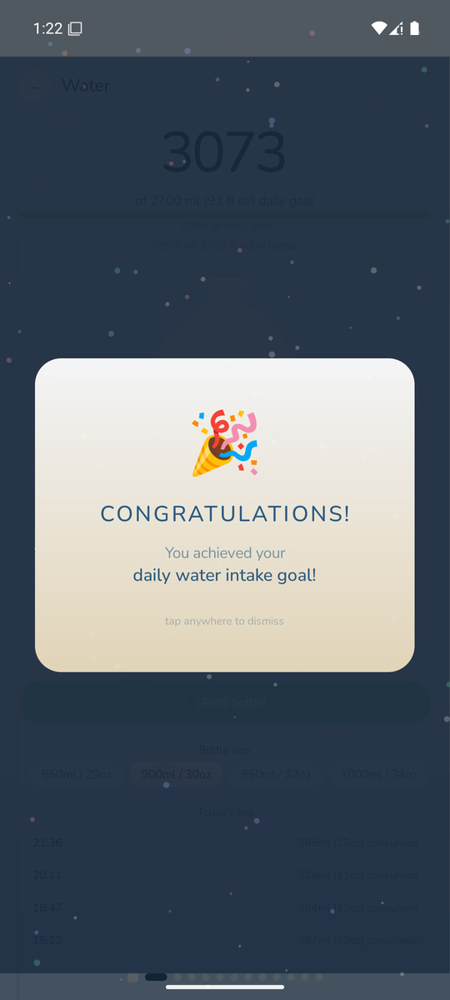
</p>
<p align="center"><sub>Left: a first sync pulling nine weeks of history. Right: what hitting a daily goal looks like.</sub></p>

**The pairing code is key material, not just access control.** It delivers a 128-bit secret that
both authenticates your phone to your desktop and derives the session keys for an encrypted
channel (ephemeral ECDH + AES-256-GCM) — someone watching your LAN traffic sees only ciphertext,
and both databases are encrypted at rest on disk. It doesn't defend against everything: anyone who
reads the code off your screen while you're pairing can pair a device of their own, and the
released phone build is still debug-signed, so USB access to an unlocked phone can still reach the
app's live data through its own debug hooks even with the database file encrypted. Use it on
networks and devices you trust; [SECURITY.md](SECURITY.md) has the full residual-risk picture.
## Building from source

<details>
<summary><strong>Prerequisites</strong> (click to expand)</summary>

- **Android SDK + JDK 17** — required. The installer bundles the phone app, and `android/app/build/`
  is gitignored, so a clean clone always builds the APK from source.
- **Node.js 18+ and [pnpm](https://pnpm.io/installation)** — use pnpm, not npm. The repo ships
  `pnpm-lock.yaml`, and `npm install` both ignores it and fails on Python 3.12+ (npm's bundled
  node-gyp 9 imports `distutils`, removed from the standard library in 3.12). pnpm installs a
  prebuilt `better-sqlite3` and never invokes node-gyp.
- **[Inno Setup 6](https://jrsoftware.org/isdl.php)** — compiles the installer.
- **Python 3** — required; the build flattens this README into the shipped `README.txt`. Pillow is
  needed only to regenerate `installer/icon/wellness.ico`, which is already committed.
- **A C++ toolchain** (Visual Studio Build Tools, "Desktop development with C++") — only if a native
  dependency has no prebuilt binary for your platform. The normal path uses prebuilds.
- **Windows SDK** (optional) — `signtool.exe` for Authenticode signing. Without it the build
  succeeds and the binaries are simply unsigned.

**Clone somewhere short**, e.g. `C:\dev\wellness-companion`. Electron's output nests `node_modules`
deep inside `dist\win-unpacked\resources\app.asar.unpacked\`, and Inno Setup is not manifested for
long paths — from a deeply-nested clone the installer step aborts partway with `The system cannot
find the path specified`. Enabling `LongPathsEnabled` does **not** help. Measured: a 120-character
clone root produced 290-character paths and failed; the same build at `C:\wcv` succeeded.

**Downloads the build fetches for you:** `vc_redist.x64.exe` (~25 MB, from `aka.ms`), embedded in
the installer. For an `offline` build only, the 2.5 GB GGUF model must already be at
`model/Qwen3-4B-Instruct-2507-GGUF/` in the repo root — a `lean` build downloads it at install time
instead.

</details>

```bat
cd windows
pnpm install
cd ..
installer\build_installer.bat            :: lean    — model downloaded at install time
installer\build_installer.bat offline    :: offline — model embedded (~2.8 GB installer)
```

Both outputs land in `installer\output\`: a version-stamped Setup exe and a matching `README.txt`.
The version comes from `windows/package.json` and is passed through to Inno Setup, so that file is
the single place to bump it.

Running the desktop app in development: `cd windows && pnpm dev`.

To ship a release-signed phone app instead of the debug build, create a keystore and an untracked
`android/keystore.properties` — see the comments at the top of `android/app/build.gradle.kts`.

## Where your data lives

| What | Where |
|---|---|
| Entries (desktop) | `%APPDATA%\wellness-companion\wellness.db` |
| Entries (phone) | app-private Room database; excluded from `adb backup` and cloud backup |
| AI model | `%LOCALAPPDATA%\wellness-companion\model\` |
| Downloaded ADB tools | `%LOCALAPPDATA%\wellness-companion\tools\` |
| Install log | `C:\Program Files\Wellness Companion\setup.log` |

Uninstalling removes the program but **keeps your database, the model, and the ADB tools** — so
reinstalling costs you neither your history nor another 2.5 GB download. Delete those folders by
hand for a clean slate.

## Architecture

```
wellness_companion/
  android/      Kotlin + Jetpack Compose; Room, Hilt, WorkManager reminders
  windows/      Electron + React + TypeScript; better-sqlite3, node-llama-cpp
  installer/    Inno Setup script, build orchestrator, model provisioning, ADB sideload
  model/        The GGUF model (not in version control — fetched at install time)
  docs/         Design spec, health guidelines, screenshots, prototypes
```

The two apps share no code, but they share a schema: entries are rows keyed by date and category.
That is what keeps the sync protocol down to a handful of WebSocket messages.

Further reading: [`docs/PROJECT_SPEC.md`](docs/PROJECT_SPEC.md) is the original pre-v1.0 design
document (see the note at its head — the shipped app diverges from it), and `docs/demo/` holds two
standalone HTML prototypes that predate the implementation.

## Contributing

Issues and PRs welcome — see [CONTRIBUTING.md](CONTRIBUTING.md). The short version: open an issue
first, build both halves, and if you touched sync, actually pair a device and confirm entries land
on both sides.

## Downloads

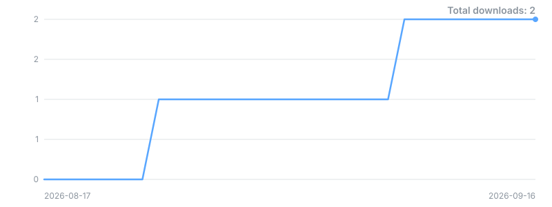

<sub>Built daily by a GitHub Action from the Releases API. GitHub keeps no historical download
data, so the curve starts on publish day.</sub>

## License

[PolyForm Noncommercial License 1.0.0](https://polyformproject.org/licenses/noncommercial/1.0.0) —
see [LICENSE](LICENSE). Free to use, modify and share for any **noncommercial** purpose: personal
projects, research, education, and use by nonprofit or government organisations. Commercial use is
not granted.

Bundled third-party components — npm packages, native libraries, Android dependencies, the Qwen3
model (Apache 2.0) and the Nunito font (SIL OFL 1.1) — keep their own licences; see
[THIRD-PARTY-LICENSES.md](THIRD-PARTY-LICENSES.md). Nothing here restricts the rights those licences
grant.

---

## Appendix: the sync protocol

<details>
<summary>What actually happens on the wire (click to expand)</summary>

The desktop advertises itself over mDNS. Every connection runs a fresh ECDH key exchange
authenticated by the paired device's 128-bit key before anything but the handshake itself is sent —
there is no plaintext step to skip.

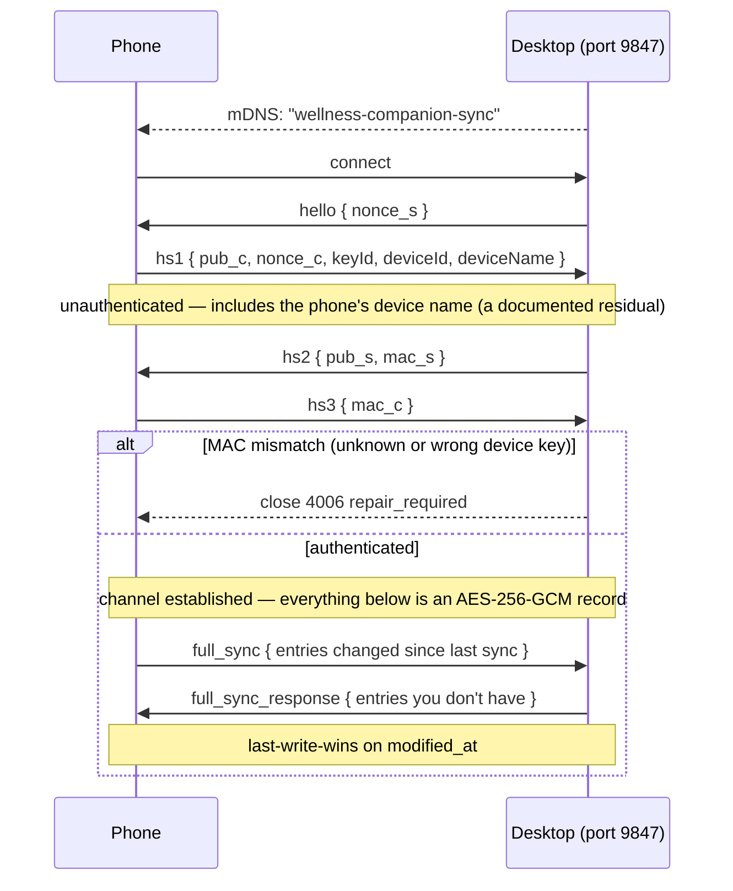

Text frames carry only the handshake; every application message after `hs3` is a binary
AES-256-GCM record. Only entries changed since the last successful sync are sent, in batches, so a
long history doesn't mean a huge transfer. Conflicts resolve last-write-wins on `modified_at`. A
peer still speaking the old plaintext protocol gets a tombstone reply and the connection is closed
before any row moves.

</details>
