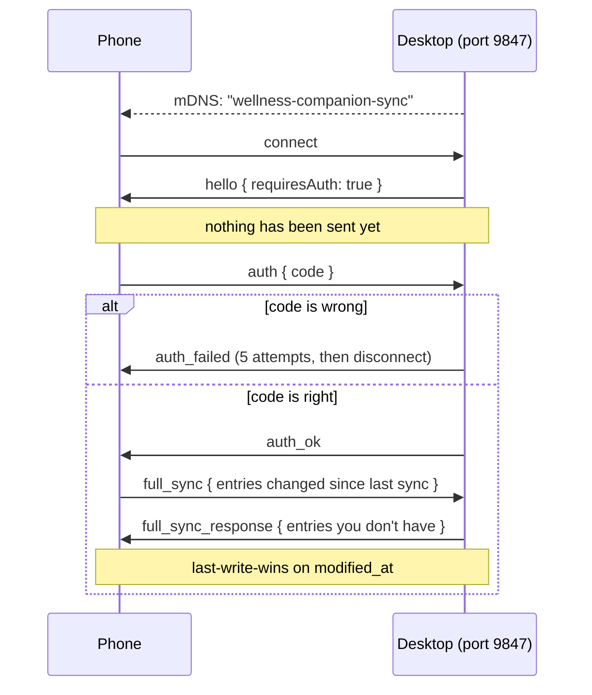

<h1 align="center">Wellness Companion</h1>

<p align="center">
  <strong>Track your day on your phone. Keep the data on your own devices.</strong>
</p>

<p align="center">
  <a href="LICENSE"></a>
  
  
  <!-- Re-enable at publish; shields cannot read a repo that does not exist yet:
  [](https://github.com/Redrum624/wellness-companion/releases)
  [](https://github.com/Redrum624/wellness-companion/releases/latest)
  -->
</p>

<p align="center">
  
  
  
  
  
</p>

---

## Why this exists

Wellness apps want your body in their cloud. Sleep, mood, menstrual cycle, symptoms, bathroom
habits — the most personal data you generate, sitting on somebody else's server under somebody
else's privacy policy, sold or breached on somebody else's timetable.

This app is the other shape of that idea. Everything lives on **your** phone and, if you want it,
**your** PC. The two talk directly to each other over your own Wi-Fi. There is no server to sign up
to, because there is no server. The AI that summarises your week is a 4-billion-parameter model
running on your own machine — your entries are never sent anywhere to be analysed.

You give up cross-device magic and cloud backup. You get a health log nobody can read but you.

## What it is

A **phone app** with twelve categories, each its own screen with its own illustrated interaction —
a water bottle you drag to drink from, a bowl that fills with origami cranes as you spend time on a
hobby, an arc that traces your mood from morning to night.

An optional **Windows companion** that stores the full history, draws a year-at-a-glance heatmap,
and writes weekly summaries with a local LLM.

| | Phone (Android) | Desktop (Windows) |
|---|---|---|
| **Role** | Primary — log things as they happen | Optional — analyse, summarise, archive |
| **Stack** | Kotlin · Jetpack Compose · Room | Electron · React · better-sqlite3 |
| **Standalone?** | Yes, fully usable alone | Needs the phone for data |
| **AI** | — | Qwen3-4B, runs locally |

---

## Quick start

**1. Get the phone app.** It isn't on Google Play. Either run the Windows installer, which bundles
the Android package and offers to sideload it over USB, or build it yourself:

```bat
cd android
gradlew.bat assembleDebug
adb install -r app\build\outputs\apk\debug\app-debug.apk
```

**2. That's it** — the phone app works on its own. Stop here if you don't want the desktop half.

**3. Optional: add the desktop app.** Download `Wellness Companion Setup <version>.exe` from the
[Releases page](https://github.com/Redrum624/wellness-companion/releases/latest) and run it. One
file contains the app, the Visual C++ runtime, and the Android package.

**4. Pair them.** Open the desktop app — its sidebar shows an eight-character code. On the phone,
tap **🔄 Sync**, enter the code, tap **Pair**, then **Sync**. Once only.

---

## How syncing works

The desktop advertises itself over mDNS and refuses to serve or accept anything until the phone
proves it knows the pairing code.



Only entries changed since the last successful sync are sent, in batches, so a long history doesn't
mean a huge transfer. If mDNS discovery fails — some networks block multicast — type the PC's
address in manually.

### Be clear about what the pairing code does

It is **access control, not encryption.** It stops other devices on your network from reading or
writing your data. It does not hide the contents from someone who can already observe your LAN
traffic: sync runs over plain `ws://`, and neither database is encrypted at rest.

Use it on networks you trust. Full detail — including what the project deliberately does *not* do —
is in [SECURITY.md](SECURITY.md).

---

## Modules

| | Module | What you log |
|---|---|---|
| 🏠 | **Dashboard** | Today at a glance: progress against each goal, plus streaks |
| 💧 | **Water** | Hydration — drag the bottle to drink; it empties as you go |
| 🥪 | **Food** | Meals and snacks with time, description and rating |
| 🌙 | **Sleep** | Bed/wake times, duration, and a sleep-quality bar |
| 🌻 | **Emotions** | Mood through the day, drawn as an arc from morning to night |
| 💚 | **Health** | Symptoms, medication, weight, general notes |
| 🚽 | **Bathroom** | Bathroom visits — for tracking a gut or urinary condition |
| 🩸 | **Cycle** | Menstrual cycle with phase prediction |
| ✅ | **Chores** | Recurring household tasks from reusable templates |
| 🎨 | **Hobbies** | Time per hobby, shown as a bowl filling with origami cranes |
| 💡 | **Ideas** | Quick capture for thoughts worth keeping |
| 💬 | **Journal** | Free-text diary entries tagged with people you saw |
| ⚠️ | **Bad Habits** | The things you're cutting down on — counted, not judged |
| 🧠 | **Insights** | AI-written weekly summaries · *desktop only* |

## Features

**Sync** — mDNS discovery, WebSocket on port 9847, gated by a pairing code · incremental transfers ·
manual IP fallback when multicast is blocked.

**On the phone** — hydration, meal, evening check-in and refill reminders · weekly trend charts ·
unit conversion · a small celebration when you hit a goal.

**On the desktop** — offline AI insights via `node-llama-cpp` · a 52-week calendar heatmap · a
chronological timeline of the day across every category.

**Everywhere** — per-category streaks · daily goals as `X/Y` progress · one-tap quick buttons for
routine amounts · star ratings, sliders and tag input with recall · a consistent pastel colour
system per category.

---

## Screenshots

<p align="center">
  
</p>
<p align="center"><sub>The desktop hub. The pairing code lives bottom-left in the sidebar.</sub></p>

---

## Building from source

<details>
<summary><strong>Prerequisites</strong> (click to expand)</summary>

- **Android SDK + JDK 17** — required. The installer bundles the phone app, and `android/app/build/`
  is gitignored, so a clean clone always builds the APK from source.
- **Node.js 18+ and [pnpm](https://pnpm.io/installation)** — use pnpm, not npm. The repo ships
  `pnpm-lock.yaml`, and `npm install` both ignores it and fails on Python 3.12+ (npm's bundled
  node-gyp 9 imports `distutils`, removed from the standard library in 3.12). pnpm installs a
  prebuilt `better-sqlite3` and never invokes node-gyp.
- **[Inno Setup 6](https://jrsoftware.org/isdl.php)** — compiles the installer.
- **Python 3** — required; the build flattens this README into the shipped `README.txt`. Pillow is
  needed only to regenerate `installer/icon/wellness.ico`, which is already committed.
- **A C++ toolchain** (Visual Studio Build Tools, "Desktop development with C++") — only if a native
  dependency has no prebuilt binary for your platform. The normal path uses prebuilds.
- **Windows SDK** (optional) — `signtool.exe` for Authenticode signing. Without it the build
  succeeds and the binaries are simply unsigned.

**Clone somewhere short**, e.g. `C:\dev\wellness-companion`. Electron's output nests `node_modules`
deep inside `dist\win-unpacked\resources\app.asar.unpacked\`, and Inno Setup is not manifested for
long paths — from a deeply-nested clone the installer step aborts partway with `The system cannot
find the path specified`. Enabling `LongPathsEnabled` does **not** help. Measured: a 120-character
clone root produced 290-character paths and failed; the same build at `C:\wcv` succeeded.

**Downloads the build fetches for you:** `vc_redist.x64.exe` (~25 MB, from `aka.ms`), embedded in
the installer. For an `offline` build only, the 2.5 GB GGUF model must already be at
`model/Qwen3-4B-Instruct-2507-GGUF/` in the repo root — a `lean` build downloads it at install time
instead.

</details>

```bat
cd windows
pnpm install
cd ..
installer\build_installer.bat            :: lean    — model downloaded at install time
installer\build_installer.bat offline    :: offline — model embedded (~2.8 GB installer)
```

Both outputs land in `installer\output\`: a version-stamped Setup exe and a matching `README.txt`.
The version comes from `windows/package.json` and is passed through to Inno Setup, so that file is
the single place to bump it.

Running the desktop app in development: `cd windows && pnpm dev`.

To ship a release-signed phone app instead of the debug build, create a keystore and an untracked
`android/keystore.properties` — see the comments at the top of `android/app/build.gradle.kts`.

## Where your data lives

| What | Where |
|---|---|
| Entries (desktop) | `%APPDATA%\wellness-companion\wellness.db` |
| Entries (phone) | app-private Room database; excluded from `adb backup` and cloud backup |
| AI model | `%LOCALAPPDATA%\wellness-companion\model\` |
| Downloaded ADB tools | `%LOCALAPPDATA%\wellness-companion\tools\` |
| Install log | `C:\Program Files\Wellness Companion\setup.log` |

Uninstalling removes the program but **keeps your database, the model, and the ADB tools** — so
reinstalling costs you neither your history nor another 2.5 GB download. Delete those folders by
hand for a clean slate.

## Architecture

```
wellness_companion/
  android/      Kotlin + Jetpack Compose; Room, Hilt, WorkManager reminders
  windows/      Electron + React + TypeScript; better-sqlite3, node-llama-cpp
  installer/    Inno Setup script, build orchestrator, model provisioning, ADB sideload
  model/        The GGUF model (not in version control — fetched at install time)
  docs/         Design spec, health guidelines, screenshots, prototypes
```

The two apps share no code, but they share a schema: entries are rows keyed by date and category.
That is what keeps the sync protocol down to a handful of WebSocket messages.

Further reading: [`docs/PROJECT_SPEC.md`](docs/PROJECT_SPEC.md) is the original pre-v1.0 design
document (see the note at its head — the shipped app diverges from it), and `docs/demo/` holds two
standalone HTML prototypes that predate the implementation.

## Contributing

Issues and PRs welcome — see [CONTRIBUTING.md](CONTRIBUTING.md). The short version: open an issue
first, build both halves, and if you touched sync, actually pair a device and confirm entries land
on both sides.

## Downloads


<sub>Built daily by a GitHub Action from the Releases API. GitHub keeps no historical download
data, so the curve starts on publish day.</sub>

## License

[PolyForm Noncommercial License 1.0.0](https://polyformproject.org/licenses/noncommercial/1.0.0) —
see [LICENSE](LICENSE). Free to use, modify and share for any **noncommercial** purpose: personal
projects, research, education, and use by nonprofit or government organisations. Commercial use is
not granted.

Bundled third-party components — npm packages, native libraries, Android dependencies, the Qwen3
model (Apache 2.0) and the Nunito font (SIL OFL 1.1) — keep their own licences; see
[THIRD-PARTY-LICENSES.md](THIRD-PARTY-LICENSES.md). Nothing here restricts the rights those licences
grant.
